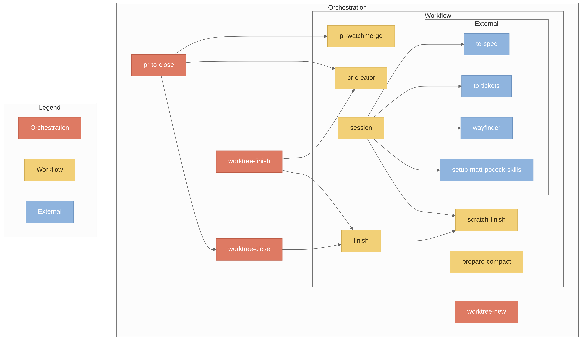
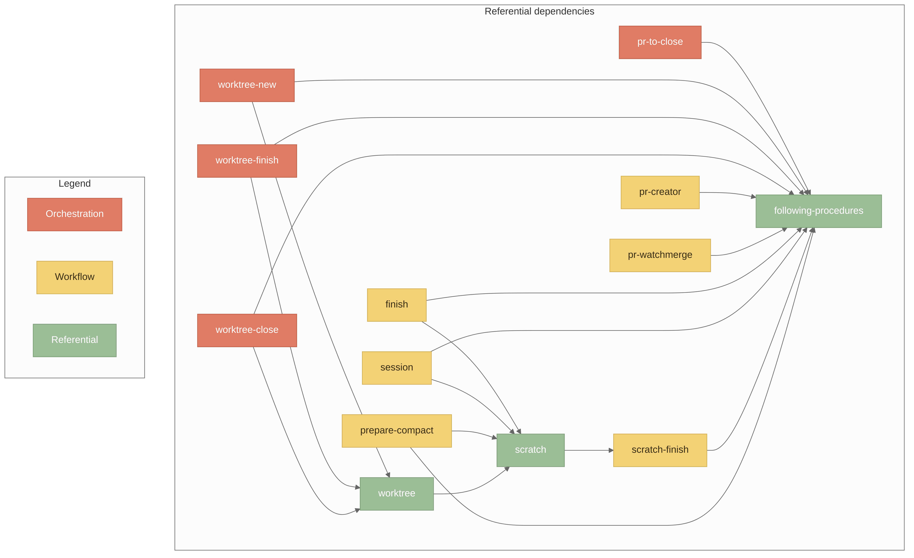
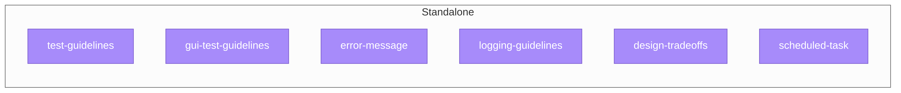

# skills

My personal agent skills.

## Install

```bash
npx skills@latest add -g fazuh/skills
```

Many skills here depends on [Matt Pocock's engineering skills](https://github.com/mattpocock/skills). Install it:

```bash
npx skills@latest add -g mattpocock/skills
```

I also use [papercuts](https://github.com/treygoff24/papercuts) for agents to issue frictions/hiccups. Install with [cargo](https://doc.rust-lang.org/cargo/getting-started/installation.html):

```bash
cargo install papercuts
```

## Skills

These split on how you'll reach for them — a guide, not hard rules about who may call what.

- **Orchestration**: Large workflows you run manually. Runs other workflows
- **Workflow**: Workflows/procedures the agent runs. You can invoke them directly, but they're usually pulled in automatically by other skills. 
- **Referential**: Modular instructions and conventions other workflows load as dependencies. 
- **Standalone**: Standards and conventions the agent consults on its own to guide what it writes.

### Orchestration (you run these)

- **[pr-to-close](./skills/pr-to-close/SKILL.md)**: Take a finished worktree branch all the way to done: open the PR, watch its CI and merge when green, then close the worktree.
- **[worktree-new](./skills/worktree-new/SKILL.md)**: Start work on a task in a new git worktree branch, keeping untracked items (`.scratch/`, `.papercuts.jsonl`) on the main project dir.
- **[worktree-finish](./skills/worktree-finish/SKILL.md)**: Finish a worktree's pull request safely: conflict resolution, readiness checks, and asking before behavior-changing resolutions.
- **[worktree-close](./skills/worktree-close/SKILL.md)**: Finish a worktree session (finish workflow) and clean up the worktree and its branch.

### Workflow (usually agent-run, yours to trigger too)

- **[pr-creator](./skills/pr-creator/SKILL.md)**: Create PRs following the repo's own template and standards; never from the default branch.
- **[pr-watchmerge](./skills/pr-watchmerge/SKILL.md)**: Watch a PR's CI checks and merge automatically once they pass.
- **[finish](./skills/finish/SKILL.md)**: End a session: update docs, propose grouped commits, archive a completed `.scratch/` workspace, summarize.
- **[session](./skills/session/SKILL.md)**: Manage a feature's session workspace: plan/spec doc, tickets, deviation log, checkpoints.
- **[scratch-finish](./skills/scratch-finish/SKILL.md)**: Archive a completed `.scratch/` workspace: the completion checklist and archive steps.
- **[prepare-compact](./skills/prepare-compact/SKILL.md)**: Prepare a session for context compaction: persist state, then clear the goal. Best used with the [opencode-context-watch plugin](https://github.com/FAZuH/opencode-context-watch/).

### Referential (loaded by other skills while they run)

- **[following-procedures](./skills/following-procedures/SKILL.md)**: How to run a numbered procedure without skipping steps: point-and-call narration, live deviation logging, and a post-run report. Every procedural skill above loads it first.
- **[scratch](./skills/scratch/SKILL.md)**: The `.scratch/` workspace mechanics: slug format, layout, lifecycle.
- **[worktree](./skills/worktree/SKILL.md)**: Work on a branch in a separate git worktree.

### Standalone (consulted on their own)

- **[test-guidelines](./skills/test-guidelines/SKILL.md)**: Test writing guidelines: validity, isolation, determinism, test doubles, anti-patterns, coverage.
- **[gui-test-guidelines](./skills/gui-test-guidelines/SKILL.md)**: GUI/E2E test automation guidelines: selectors, Page Object, visual regression, accessibility.
- **[error-message](./skills/error-message/SKILL.md)**: Write/review error message strings per std-library conventions.
- **[logging-guidelines](./skills/logging-guidelines/SKILL.md)**: Structured logging with wide events, correlation, and safe redaction.
- **[design-tradeoffs](./skills/design-tradeoffs/SKILL.md)**: Compare design options with structured tradeoff analysis.
- **[scheduled-task](./skills/scheduled-task/SKILL.md)**: Manage scheduled tasks through crontab and systemd timers.

### Dependency Diagrams







## License

MIT
